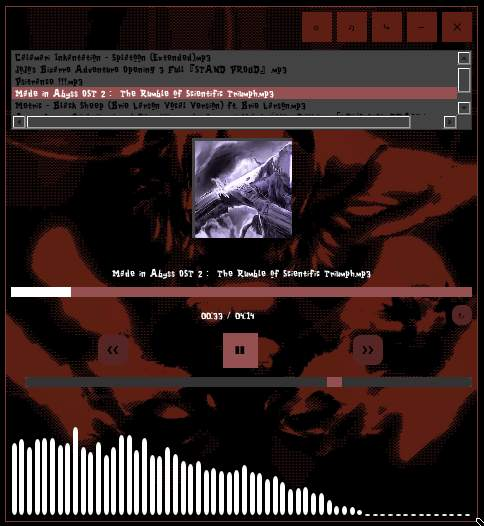

# 🎵 NyrvanaPlayer

A modern, customizable music player built with PyQt6 and pygame, featuring real-time audio visualization and integrated YouTube downloader with automatic MP3/GIF conversion.




## ✨ Features

- **Custom Audio Visualizer**: Built from scratch (pydub is no longer supported in Python 3.14+)
- **YouTube Integration**: Search and download music directly from YouTube
- **Automatic Conversion**: MP4 to MP3 + GIF extraction via custom C converter
- **Animated UI**: Smooth hover/click animations on all buttons
- **Playlist Management**: Hot-reload playlist without restarting
- **Loop Mode**: Repeat your favorite tracks
- **Volume Control**: Smooth volume slider with visual feedback
- **Tiled/Floating Mode**: Works in both window manager modes
- **Custom Theming**: Fully customizable via JSON config
- **Drag & Drop**: Frameless window with drag support

## 📋 Requirements

### System Dependencies
```bash
# Debian/Ubuntu
sudo apt install python3-pyqt6 python3-pygame ffmpeg

# Arch Linux
sudo pacman -S python-pyqt6 python-pygame ffmpeg

# Fedora
sudo dnf install python3-PyQt6 python3-pygame ffmpeg
```

### Python Dependencies
```bash
pip install PyQt6 pygame yt-dlp
```

### Build C Converter
```bash
cd core
gcc -o convert convert.c -lavcodec -lavformat -lavutil -lswscale -lswresample -lgif
```

## 🚀 Quick Start

### 1. Clone the repository
```bash
git clone https://github.com/yourusername/NyrvanaPlayer.git
cd NyrvanaPlayer
```

### 2. Install dependencies
```bash
pip install -r requirements.txt
```

### 3. Launch the player
```bash
# Floating mode (default)
python3 main.py

# Tiled mode (for tiling window managers like bspwm)
python3 main.py --tiled
```

### 4. Download music
```bash
# Launch the downloader UI
python3 research.py
```

## 📁 Project Structure
```
NyrvanaPlayer/
├── main.py              # Main music player application
├── research.py          # YouTube downloader UI
├── config_ui.py         # Configuration UI (if exists)
├── config.json          # Player configuration
├── core/
│   ├── convert          # C binary for MP4→MP3+GIF
│   ├── convert.c        # C source code
│   ├── actions.py       # Music playback controls
│   └── visualizer.py    # Custom audio visualizer (from scratch)
├── assets/
│   ├── music/           # Your music library (.mp3 + .gif pairs)
│   ├── gifs/            # UI assets (load.gif, etc.)
│   └── images/          # Background images
└── README.md
```

## 🎮 Usage

### Main Player Controls

| Button | Action |
|--------|--------|
| `➤` / `❚❚` | Play/Pause |
| `❮❮` | Previous track |
| `❯❯` | Next track |
| `↻` | Toggle loop mode |
| `♫` | Open downloader |
| `⤷` | Reload playlist |
| `☼` | Open config UI |
| `—` | Minimize window |
| `✕` | Close player |

### Downloader (research.py)

1. Enter song title or YouTube URL
2. Click "Download"
3. Wait for conversion (MP4 → MP3 + GIF)
4. Files appear in `assets/music/`
5. Click reload (`⤷`) in main player to refresh playlist

### Progress Bar

- **Click** anywhere on the progress bar to seek
- Displays current time / total duration

### Volume Slider

- Drag slider or click to set volume
- Icon changes: 🔇 (mute) ↔ 🔊 (loud)

## ⚙️ Configuration

Edit `config.json` to customize:

- Window size and appearance
- Button colors, shapes, sizes
- Progress bar style
- Volume slider appearance
- Visualizer settings (bars, colors, intensity)
- Animations (hover/click effects)
- Background image/GIF

**Example:**
```json
{
  "window": {
    "width": 270,
    "height": 370,
    "background_color": "#434343"
  },
  "buttons": {
    "play": {
      "shape": "square",
      "color": "#955151",
      "size": [35, 35]
    }
  },
  "visualizer": {
    "enabled": true,
    "num_bars": 60,
    "color_start": "#ffffff",
    "intensity": 5.0
  }
}
```

## 🎨 Custom Visualizer

The audio visualizer is **built from scratch** because pydub is no longer supported in Python 3.14+. 

Implementation details:
- Real-time FFT analysis using pygame mixer
- Customizable bar count, colors, and intensity
- Smooth animations and gradient support
- No external audio analysis libraries required

## 🔧 Troubleshooting

### "Module not found" errors
```bash
pip install --upgrade PyQt6 pygame yt-dlp
```

### C converter fails to compile
```bash
# Install FFmpeg development libraries
sudo apt install libavcodec-dev libavformat-dev libavutil-dev libswscale-dev libswresample-dev libgif-dev
```

### YouTube download fails
- Check your internet connection
- Update yt-dlp: `pip install --upgrade yt-dlp`
- Try a different video/query

### No audio output
- Check pygame mixer initialization
- Verify audio files are valid MP3 format
- Check system volume settings

### GIF not displaying
- Ensure `.gif` file has same name as `.mp3` (excluding extension)
- Example: `song.mp3` + `song.gif`

## 🐛 Known Issues

- `.webm.part` files (incomplete downloads) won't play - delete them manually
- Very long track names may overflow UI elements
- GIF playback may lag on low-end systems

## 🛠️ Development

### Adding new features

1. **New button**: Edit `config.json` → Add to `setup_ui()` in `main.py`
2. **Custom action**: Add function to `core/actions.py`
3. **Visualizer effect**: Modify `core/visualizer.py`

### Testing
```bash
# Run with debug output
python3 main.py --tiled

# Test converter
./core/convert path/to/video.mp4
```

## 📝 License

MIT License - Feel free to modify and distribute

## 🤝 Contributing

Contributions welcome! Please:
1. Fork the repository
2. Create a feature branch
3. Submit a pull request

## 💡 Tips

- Keep music files organized in `assets/music/`
- Use descriptive filenames for better playlist readability
- Pair each `.mp3` with a `.gif` for visual feedback
- Adjust visualizer intensity for different music genres
- Use tiled mode (`--tiled`) with bspwm, i3, or similar WMs

## 📧 Support

For issues or questions, please open a GitHub issue.

---

**Made with ❤️ and Python**
